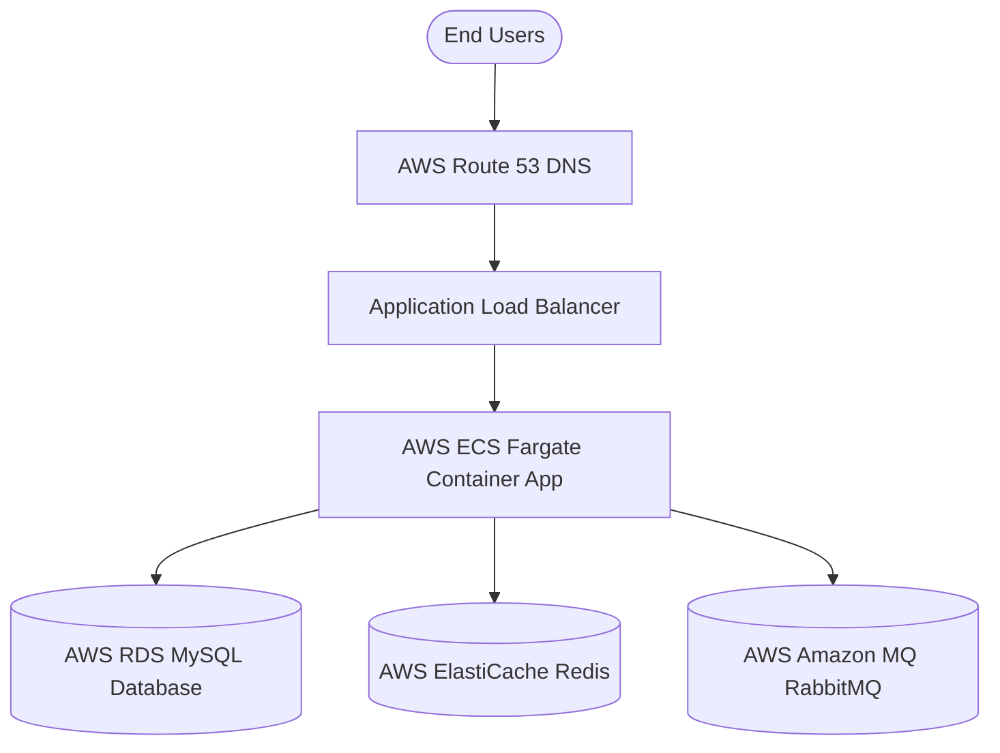

# AWS Deployment Guide for Smart Logistics SCM

This guide details the step-by-step process of hosting and deploying the containerized Smart Logistics & Supply Chain Management System on Amazon Web Services (AWS) using production-grade managed services.

---

## Architecture Overview



---

## 1. Prerequisites
- An AWS Account.
- AWS CLI configured locally with administrative credentials.
- Docker desktop and Git installed locally.

---

## 2. Infrastructure Setup (AWS Managed Services)

### A. Database: AWS RDS MySQL
1. Open the **Amazon RDS console**.
2. Click **Create database**.
3. Choose **Standard create** -> **MySQL**.
4. Set Engine version to `8.0`.
5. Select the **Production** template (or Dev/Test for trial).
6. DB instance identifier: `smart-logistics-db`.
7. Master username: `root` (or a secure custom username).
8. Credentials: Set a strong master password (e.g., `ProdSecurePassword2026`).
9. Enable **Automatic Backups** and configure multi-AZ deployment for high availability.
10. Under **Connectivity**, configure security groups to allow inbound access on port `3306` only from your ECS task security group.

### B. Caching: AWS ElastiCache for Redis
1. Open the **Amazon ElastiCache console**.
2. Click **Create Redis cluster**.
3. Cluster engine: **Amazon ElastiCache for Redis**.
4. Set Node type (e.g., `cache.t4g.medium`).
5. Set Number of replicas: `1` (for high availability).
6. Enable encryption-in-transit (TLS) and encryption-at-rest.
7. Configure security groups to allow inbound access on port `6379` from the ECS security group.

### C. Message Broker: AWS Amazon MQ for RabbitMQ
1. Open the **Amazon MQ console**.
2. Click **Create brokers**.
3. Select broker engine: **RabbitMQ**.
4. Deployment mode: **Active/standby replication** (for production multi-AZ) or **Single-instance** (for dev/test).
5. Specify broker name: `smart-logistics-broker`.
6. Set broker instance type (e.g., `mq.t3.micro`).
7. Define login credentials: username `guest`, password `guest` (or custom secure credentials).
8. Adjust security group inbound rules to allow port `5671` (AMQPS) or `5672` (AMQP) from the ECS tasks.

---

## 3. Containerize & Push App to AWS ECR

### A. Create an ECR Repository
```bash
aws ecr create-repository --repository-name smart-logistics-app --region us-east-1
```

### B. Authenticate Docker with ECR
```bash
aws ecr get-login-password --region us-east-1 | docker login --username AWS --password-stdin <AWS_ACCOUNT_ID>.dkr.ecr.us-east-1.amazonaws.com
```

### C. Build, Tag, and Push the Docker Image
```bash
# Clean build and compile
mvn clean package -DskipTests

# Build Docker image
docker build -t smart-logistics-app .

# Tag image
docker tag smart-logistics-app:latest <AWS_ACCOUNT_ID>.dkr.ecr.us-east-1.amazonaws.com/smart-logistics-app:latest

# Push to ECR Registry
docker push <AWS_ACCOUNT_ID>.dkr.ecr.us-east-1.amazonaws.com/smart-logistics-app:latest
```

---

## 4. Run Application on AWS ECS (Fargate)

### A. Define ECS Task Definition (`task-definition.json`)
Create a Task Definition file mapping ECR image and environment variables:
```json
{
  "family": "smart-logistics-task",
  "networkMode": "awsvpc",
  "requiresCompatibilities": ["FARGATE"],
  "cpu": "1024",
  "memory": "2048",
  "containerDefinitions": [
    {
      "name": "app",
      "image": "<AWS_ACCOUNT_ID>.dkr.ecr.us-east-1.amazonaws.com/smart-logistics-app:latest",
      "portMappings": [
        {
          "containerPort": 8080,
          "hostPort": 8080
        }
      ],
      "environment": [
        { "name": "PORT", "value": "8080" },
        { "name": "DATABASE_URL", "value": "jdbc:mysql://<RDS_ENDPOINT>:3306/smart_logistics?useSSL=false&serverTimezone=UTC" },
        { "name": "DB_USER", "value": "root" },
        { "name": "DB_PASSWORD", "value": "ProdSecurePassword2026" },
        { "name": "REDIS_HOST", "value": "<REDIS_ENDPOINT>" },
        { "name": "REDIS_PORT", "value": "6379" },
        { "name": "RABBITMQ_HOST", "value": "<AMAZON_MQ_ENDPOINT>" },
        { "name": "RABBITMQ_PORT", "value": "5671" }
      ],
      "logConfiguration": {
        "logDriver": "awslogs",
        "options": {
          "awslogs-group": "/ecs/smart-logistics",
          "awslogs-region": "us-east-1",
          "awslogs-stream-prefix": "ecs"
        }
      }
    }
  ]
}
```

### B. Register Task and Deploy ECS Service
1. Register the task:
   ```bash
   aws ecs register-task-definition --cli-input-json file://task-definition.json
   ```
2. Create an **ECS Cluster** (Networking only/Fargate template).
3. Create an **ECS Service** pointing to the task definition, inside the cluster.
4. Place the service behind an **Application Load Balancer (ALB)** to handle public traffic, configure health check endpoint `/login` or `/api/products` (expecting standard `200` or `302` response codes).
5. Attach Route 53 Domain Name to point to the ALB DNS record.
