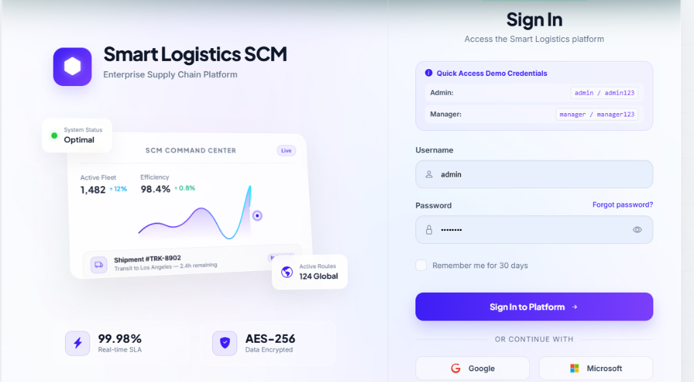
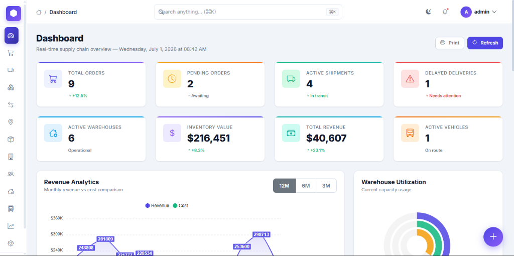
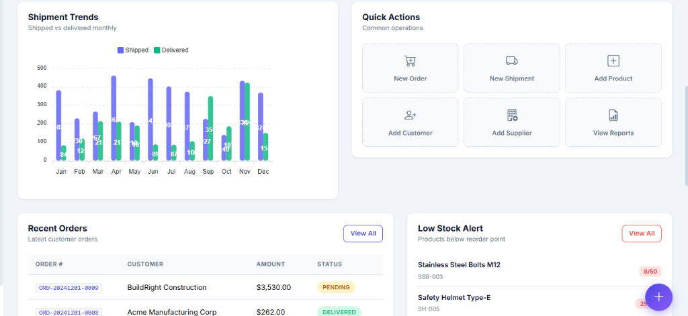
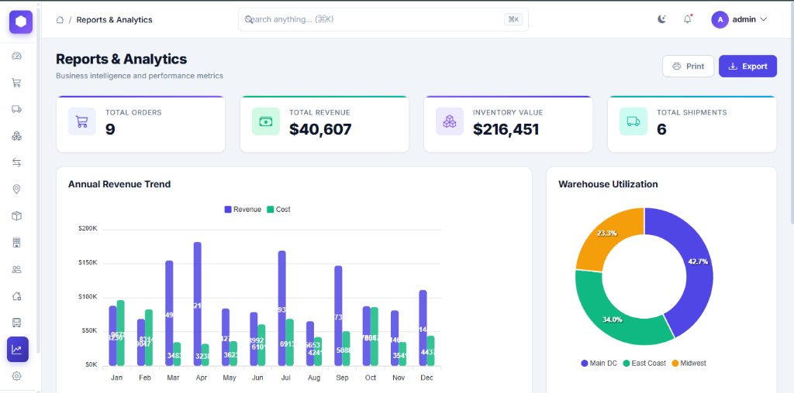

# Smart Logistics & Supply Chain Management System

An enterprise-grade, high-performance web application designed to streamline modern logistics, warehouse management, real-time transport tracking, and automated inventory reconciliation. Built on **Spring Boot 3**, **Hibernate**, and **MySQL**, with optional caching via **Redis** and message brokerage via **RabbitMQ**.

---

## 🚀 Key Features

* **Interactive Executive Dashboard**: Live KPIs, dynamic Area Charts (Revenue Analytics with 12M/6M/3M period filtering), radial capacity meters for Warehouse Utilization, and Recent Activity logs.
* **Global Autocomplete Command Palette**: A debounced fuzzy-search command dropdown in the navigation header querying across Products, Orders, Shipments, and Warehouses.
* **Glassmorphism 2.0 Identity Portal**: Frosty glass UI with responsive 3D dashboard perspectives, real-time shipment counters, and custom CSS grid animations.
* **Inventory & Stock Movements**: Dynamic tracking of stock levels with support for Inbound, Transfer, Outbound, and Adjustment type records.
* **Shipment & Delivery Pipeline**: Real-time tracking progress logs mapping shipments to routes, drivers, and vehicles with instant status propagation.
* **Admin Profile Console**: Detailed view of the logged-in administrator's profile, roles, assigned departments, and system privileges.
* **Cloud-Resilient Caching**: Automated Redis bypass using a custom `CacheErrorHandler`. If Redis is offline, the app handles errors gracefully and queries the DB directly.

---

## 📸 Application Interface

### 🔐 Glassmorphism 2.0 Login Portal


### 📊 Executive Analytics Dashboard


### 🚚 Shipment Status & Quick Action Center


### 📈 Reports & Detailed Metrics Console


---

## 🛠️ Technology Stack

* **Backend**: Java 17+, Spring Boot 3.2.1, Spring Security (JWT-ready), Spring Data JPA
* **Frontend**: HTML5/Thymeleaf, CSS3 (Vanilla Glassmorphic theme), JavaScript (ES6+), Bootstrap 5, ApexCharts
* **Database**: MySQL 8.0
* **Caching**: Redis 7.0 (Optional/Bypassed if unavailable)
* **Messaging**: RabbitMQ (Optional status publisher)
* **Build System**: Maven 3.9+
* **Deployment**: Docker & Docker Compose, Render.com / AWS-compatible

---

## 💻 Local Development Setup

### 1. Prerequisites
Ensure you have the following installed locally:
* **JDK 17 or 21**
* **MySQL Server** (Running locally on port 3306)
* **Maven 3.9+**

### 2. Configure Local Database
Create a database named `smart_logistics` in MySQL:
```sql
CREATE DATABASE smart_logistics;
```

Update your local connection details in `src/main/resources/application.properties` or set these environment variables:
```cmd
set DATABASE_URL=jdbc:mysql://localhost:3306/smart_logistics?useSSL=false&serverTimezone=UTC&allowPublicKeyRetrieval=true
set DB_USER=root
set DB_PASSWORD=root
```

### 3. Build & Run
Compile the application and run it locally:
```cmd
# 1. Switch session to JDK 21 (if necessary)
set JAVA_HOME=C:\Program Files\Java\jdk-21
set PATH=C:\Program Files\Java\jdk-21\bin;%PATH%

# 2. Package the jar
mvn clean package -DskipTests

# 3. Launch the server
mvn spring-boot:run
```
Once initialized, navigate to:
👉 **[http://localhost:8080/dashboard](http://localhost:8080/dashboard)**

* **Admin Username**: `admin`
* **Admin Password**: `admin123`

---

## 🐳 Containerized Deployment (Docker Compose)

Deploy the entire microservice architecture (App, MySQL, Redis, RabbitMQ) with one command:

```bash
# 1. Pack the application
mvn clean package -DskipTests

# 2. Start the Docker containers
docker compose up --build -d
```

To stop all services:
```bash
docker compose down
```

---

## ☁️ Production Cloud Deployment (Render.com + Aiven.io)

This project is built to support deploy-anywhere architectures out-of-the-box.

### Render Configuration
1. Create a **Web Service** on Render and link your GitHub repository.
2. Select **Docker** as the Runtime (Render will build the app using our multi-stage `Dockerfile`).
3. Add the following **Environment Variables** in Render:
   - `DATABASE_URL`: `jdbc:mysql://<Aiven-Host>:<Aiven-Port>/defaultdb?ssl-mode=REQUIRED&allowPublicKeyRetrieval=true`
   - `DB_USER`: `avnadmin`
   - `DB_PASSWORD`: `<your-aiven-db-password>`
   - `DDL_AUTO`: `update`

---

## 📂 Project Architecture

```text
src/main/java/com/logistics/
├── config/             # Spring Security, Redis caching, and Database Initializers
├── controller/         # MVC Controllers for views and Thymeleaf rendering
├── rest/               # REST Endpoints for Ajax / Autocomplete services
├── dto/                # Data Transfer Objects
├── entity/             # JPA Hibernate Entities
├── repository/         # Database Repository interfaces
├── service/            # Core business logic interfaces
└── serviceimpl/        # Core business logic implementations
```
